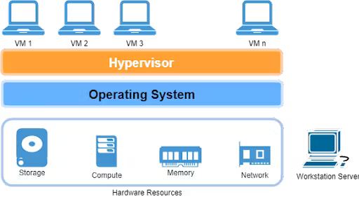
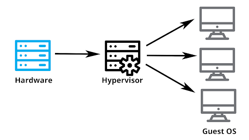
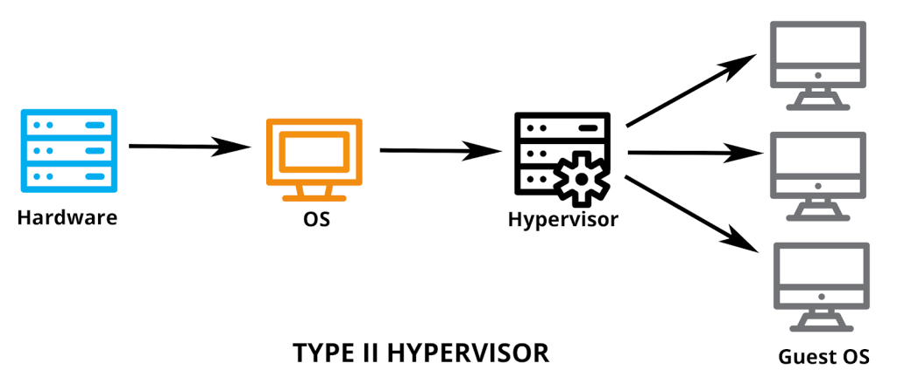
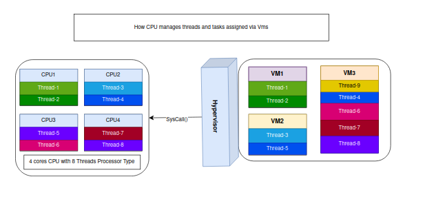
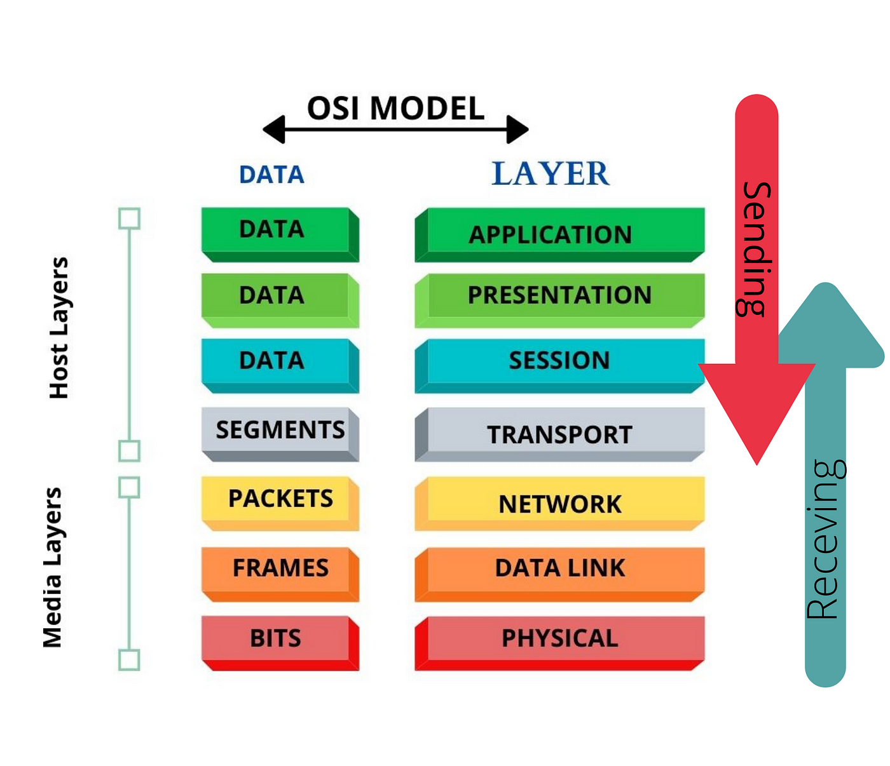
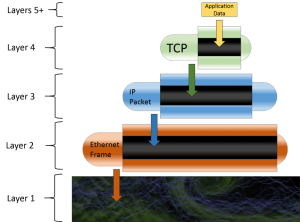
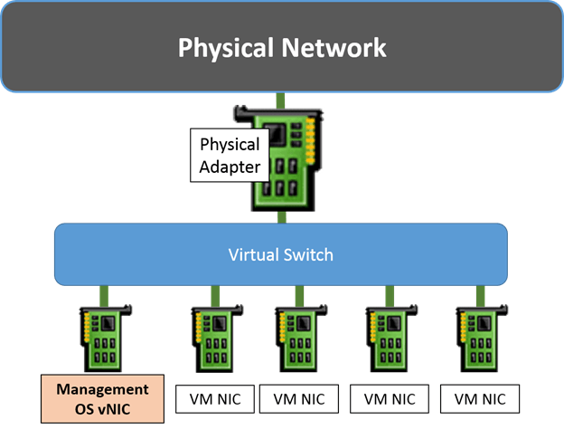
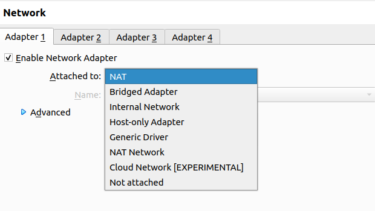

# What is virtualization?

Virtualization is a process that allows for more efficient utilization of physical computer hardware and is the **foundation of cloud computing**.

Virtualization uses s/w to create an abstraction layer over computer h/w that allows the h/w elements of a single computer - processors, memory, storage, and more to be divided into multiple virtual computers, commonly called **virtual machines(VMs)**. 

Each VM runs its own operating system (OS) and behaves like an independent computer, even though it is running on just a portion of the actual underlying computer h/w.

# what is hypervisor?
The concept that we know virtualization is actually a technology whereas this hypervisor is its actual implementation.

**A hypervisor is a s/w or h/w component that enables the creation and management of virtual machines.**

### Types of hypervisors:

There are two primary types:

 Type 1 hypervisors (bare metal hypervisors):

 - Run directly on the host without the need for un underlying operating system. 
 - offer superior performance and efficiency.
 - examples: KVM (Kernel-based VM), VMware vSphere Hypervisor(ESXi), MS Hyper-V Server, and Xen.

Type 2 hypervisors (hosted hypervisors):

- Run on top of a host os in the user space.
- more user-friendly. 
- suitable for desktop or development env.
- examples: VMware workstation, VirtualBox, and Parallels Desktop.

### How hypervisors share or manages CPUs to across VMs running?

- sharing cpu or scheduling the threads to each core on the cpu is something that managed by host-os. The same idea applies to hypervisor. It does the same thing. 
- Allocating required CPU count to a VM doesn't mean that we have fixed those of pCPU to that VM.
- It works on top of that, We must know how threads get schedulled/queued to get tasks done by cores/processors.

The above example explains how hypervisor helps to manage the tasks/threads requires from diff. VMs to be done.

As you can see, In VM3 it has a task/thread-9 where it's not yet allocated to any of the core cpu as there's no empty thread to pick it up. In this scenario it get into queue and once any task gets completed. It will be picked up and get done. This is how Core-Thread helps in multi-tasking concepts.

**Note: VMs Thread is not more than a process to a physical CPU. Same applies to all other resources. No matter what count or size we allocate to a VM it consumes only the required amount of resources.**

**Note: We can have as many as logical CPU in all total count of running VMs.**

**Note: We can't have more than the count of physical-CPU to any individual VM.**

# Hypervisor networking:

> Ofcourse, We have OSI (Open Systems Interconnection) model concept at the begining when we discuss about networking in technical sense.

**Note:**
- Layer 1 (Physical): This is the elctrons, wires/fibers, swtich ports and network adapters things.

- Layer 2 (Data Link): In hyper-v world, it's going to be Ethernet. Where we talk in **Frames**

    -->  It starts with header, ends with validation bits.
    --> It only cares about the ordering of incoming/outgoing bits.
    --> Ofcourse, Destination and Source MAC address.
    --> Yes, VLANs details could be found at Layer 2 or 3. The above layers doesn't know or care about this.
    --> Payload contains, TCP/IP packet or IPX/SPX packet or NetBEUI packet or anything. 
    --> All ethernet is cares about is the destination MAC address. Once the frame is delivered, layer 2 will unpackage the packet and deliver it up to layer 3 to deal with.

- Layer 3 (Network): This is where we talk about TCP/IP protocols. In Hypervisors at this level, we have Virtual Network Adapter. Where, it connects to Hypervisors virtual switch into the layer three world of the management OS.
    
    Note:  Hence,  virtual switch and virtual adapters are in layer 1 and 2.

- Layer 4 (Transport): This is where we mostly talk about TCP/IP stack, **TCP** and **UDP**.
   

 > With this the best summary of the process described by the OSI model is that networking is a series of **encapsulation**. 

> Finally after going through the OSI model, We came up with **Virtual Switch** and **Virtual Network Adapter** in respect with hypervisor networking pov.

### Virtual Swtich
Virtual switch that becomes important aspects when we compares it with physical switches, where it behave in the same way and directs the packets to MAC addresses along with VLAN tagging.

Types of virtual switch:
- private v-swtich
- internal v-swtich
- public v-swtich

#### Private Swtich:
- It allows the communications among the virtual machines on its host and nothing else.
- Even, management os is not allowed to participate.

#### Internal switch:
- similiar to private with one exception.
   exception:**The management OS can have virtual adapter on this type of switch**.
- This allows management os to communicate to any VMs that also have virtual adapters on the same internal switch.

#### External Switch:
- This must be connected to a physical adapter. 
- It allows communications between the physical network and the management operating system and virtual adapters on virtual machines.

> Now, Let's see how overall networking looks like in hypervisor.

Now, In realtime let's dig further into network adapters.

let's take an example of locally operating into virtualbox's networking settings,

So, we have various options while enabling network adapter for a virtual machine. As below,

* NAT
* Bridged Adapter
* Internal Network
* Host-only Adapter
* Generic Driver
* NAT Network
* Cloud Network(Experimental)

| Mode              | VM <-> VM | VM -> Host | Host -> VM | VM -> Physical LAN | Physical LAN -> VM |
| ---------------   | --------- | ---------- | ----------- | ------------------- | --------------------|
| NAT               | -         | +          | Port-Forward| Yes                 | Port-Forward        |
| Bridged Adapter   | +         | +          | +           | +                   |  +                  |
| Internal Network  | +         | -          | -           | -                   |  -                  |
| Host-only Adapter | +         | +          | +           | -                   |  -                  |
| NAT network       | +         | +          | Port-Forward| +                   | Port-Forward        |

